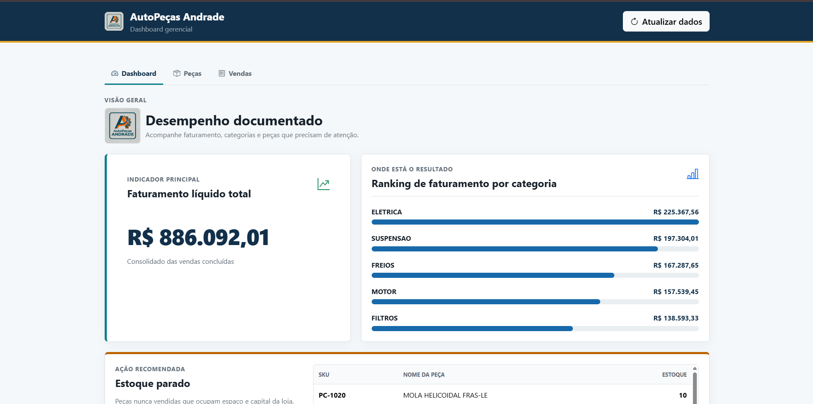
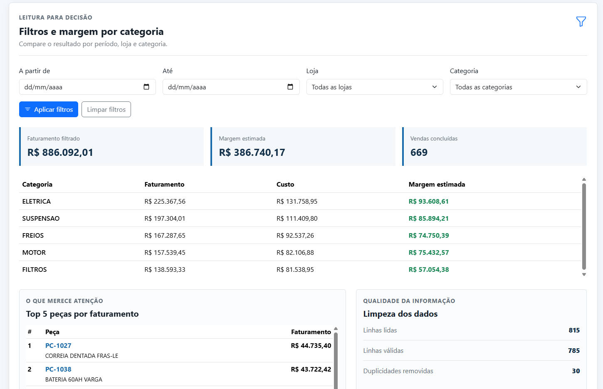
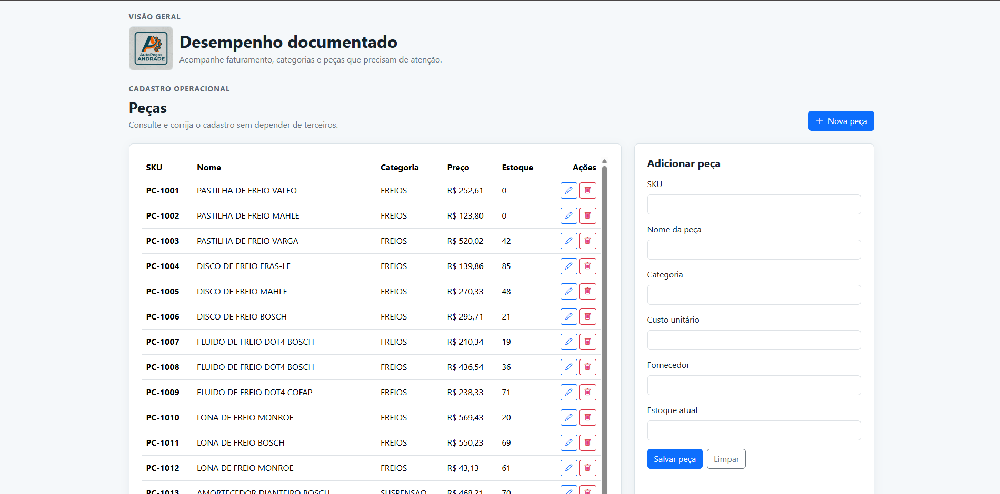
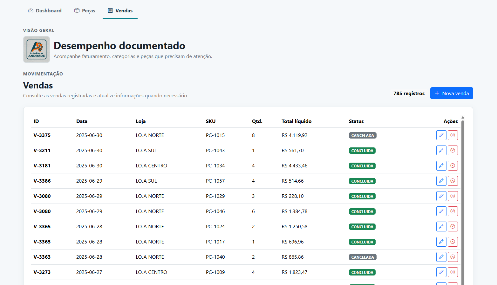
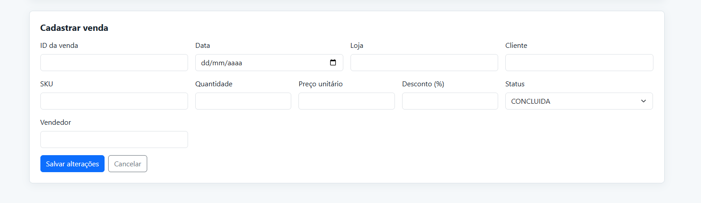

# AutoPeças Andrade

Sistema gerencial desenvolvido para o case técnico da Meerkat Coding.


## Respostas do case

1. **Faturamento líquido total:** R$ 886.092,01.

2. **Categorias que mais faturaram:**
   - ELETRICA: R$ 225.367,56
   - SUSPENSAO: R$ 197.304,01
   - FREIOS: R$ 167.287,65
   - MOTOR: R$ 157.539,45
   - FILTROS: R$ 138.593,33
3. **Peças com estoque maior que zero e nunca vendidas:** 5 peças
   | SKU | Nome da peça | Estoque |
   |---------|--------------|---------|
   | PC-1020 | MOLA HELICOIDAL FRAS-LE | 10 |
   | PC-1022 | BIELETA VALEO | 10 |
   | PC-1031 | BOMBA D'AGUA MONROE | 17 |
   | PC-1036 | FILTRO DE OLEO FRAS-LE | 22 |
   | PC-1044 | FAROL DIANTEIRO COFAP | 17 |

**Repositório:** [github.com/MatheusASilva/TesteTecnico_Meerkat](https://github.com/MatheusASilva/TesteTecnico_Meerkat)

## Demonstração

### Dashboard



### Filtros, margem e qualidade dos dados



### Cadastro de peças



### Consulta de vendas



### Cadastro e edição de vendas



## Como executar

1. Crie ou ative um ambiente virtual:

```powershell
python -m venv venv
.\venv\Scripts\Activate.ps1
pip install -r requirements.txt
```

2. Crie `config/.env` com a variável `DATABASE_URL` do banco PostgreSQL/Supabase.

3. Formate os CSVs e carregue os dados no banco:

```powershell
python -m formatacao.envia_dados_supabase
```

O carregamento usa upsert e a chave de conflito `sku` para peças e `id_venda + sku` para vendas. Assim, executar o comando novamente não duplica os registros. O script também informa quantas duplicidades foram removidas.

4. Inicie a aplicação:

```powershell
python -m uvicorn controllers.main:app --reload --port 8000
```

Acesse `http://localhost:8000`.

5. Execute os testes:

```powershell
python -m pytest -q
```

## Organização

- `controllers/`: rotas da API FastAPI.
- `model/`: entidades e acesso ao PostgreSQL usando DAO.
- `formatacao/`: tratamento, deduplicação e carga dos CSVs.
- `view/`: dashboard, cadastro de peças e consulta de vendas.
- `tests/`: testes automatizados do tratamento dos dados.

A tela apresenta o dashboard analítico, filtros por período, loja e categoria, margem estimada por categoria e CRUD de peças. As vendas podem ser cadastradas, consultadas, editadas e canceladas.

Como informações extras, o dashboard mostra a qualidade da limpeza dos dados e um ranking Top 5 das peças com maior faturamento, respeitando os filtros aplicados.
